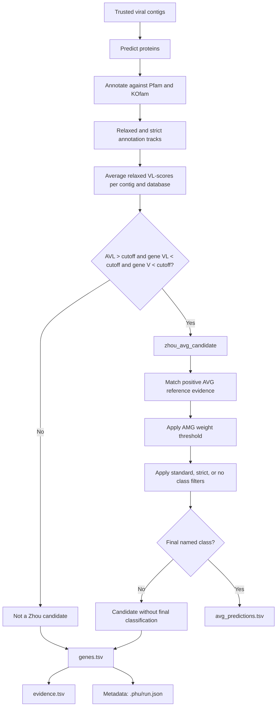

# avger

`phu avger` predicts proteins from trusted viral contigs and annotates them
against the complete Pfam and KOfam databases, then applies the provisional AVG
candidate and curation workflow. It writes deterministic TSV tables for all
genes, candidates, predictions, and supporting evidence.

This is the supported annotation/evidence workflow. The repository also
contains the implementation modules used internally by this command; they are
not exposed as separate subcommands.

## Synopsis

```bash
phu avger -i contigs.fa -o phu-avger
```

### Options

The command-line menu is available directly with `phu avger --help`:

```text
Usage: phu avger [OPTIONS]

Predict and curate putative auxiliary viral genes.

╭─ Options ────────────────────────────────────────────────────────────────────────────────────────╮
│ *  --input-contigs        -i                    <path>                   Trusted viral contigs   │
│                                                                          FASTA                   │
│                                                                          [required]              │
│    --output-folder        -o                    <path>                   Output directory        │
│                                                                          [default: phu-avger]    │
│    --threads              -t                    <int range> [x>=1]       [default: 1]            │
│    --mode                 -m                    <str>                    pyrodigal mode:         │
│                                                                          meta|single             │
│                                                                          [default: meta]         │
│    --min-gene-len                               <int range> [x>=1]       [default: 90]           │
│    --min-protein-len-aa                         <int range> [x>=1]       [default: 30]           │
│    --ttable               -T                    <int range> [x>=1]       [default: 11]           │
│    --min-amg-weight                             <float range>            [default: 0.6]          │
│                                                 [0.0<=x<=1.0]                                    │
│    --filter-mode                                <str>                    [default: standard]     │
│    --keep-hits                --no-keep-hits                             [default: no-keep-hits] │
│    --scaffold-avl-cutoff                        <float range> [x>=0.0]   [default: 3.0]          │
│    --gene-vl-cutoff                             <float range> [x>=0.0]   [default: 3.0]          │
│    --gene-v-cutoff                              <float range> [x>=0.0]   [default: 10.0]         │
│    --scoring-evalue                             <float range> [x>=0.0]   [default: 1e-05]        │
│    --quiet                                                               Suppress routine        │
│                                                                          progress output.        │
│    --verbose                                                            Show additional         │
│                                                                          progress details.       │
│    --help                 -h                                             Show this message and   │
│                                                                          exit.                   │
╰──────────────────────────────────────────────────────────────────────────────────────────────────╯
```

The exact spacing and formatting may vary slightly with the Typer/Rich version
installed locally.

The command requires prepared Pfam, KOfam, and AVG reference databases. It
reuses the shared prediction cache. KOfam hits use the thresholds and score
types from `ko_list`; Pfam hits use model GA cutoffs. Candidate scoring uses
the AVG reference database's V-score and VL-score tables.

## Scientific interpretation

### What AVG means

AVG means **auxiliary viral gene**: a viral gene that is auxiliary to core viral
functions. The broader AVG category includes genes that may increase viral
fitness by maintaining or manipulating host functions during infection. In
this project, the proposed classes are:

- **AMG (auxiliary metabolic gene):** associated with maintaining or
    manipulating host metabolism during infection.
- **APG (auxiliary physiology gene):** associated with a host physiology-related
    function.
- **AReG (auxiliary regulatory gene):** associated with regulating host gene
    expression or other cellular regulatory processes.

These classes are written as `putative_amg`, `putative_apg`, and
`putative_areg` in the output tables. They are proposed functional classes,
not confirmed biological categories. Candidate effects may be small or large
and condition-dependent, and a class assignment requires evidence beyond
function prediction.

This terminology follows Martin et al. (2025). The `avger` workflow uses
viral-context evidence, profile annotations, V/VL scores, AVL, and curated
reference records to prioritize AVG candidates. An AVG is not synonymous with
an AMG: AMGs are one functional subset, while the broader AVG framework also
includes non-metabolic effects on bacterial-host fitness. These computational
signals do not by themselves demonstrate a fitness effect in a bacterial host.

This interpretation is consistent with the broader view that virus-host
relationships involve both host-range effects and molecular interactions
between viral and host proteins. Iuchi et al. provide a review of those
bioinformatics approaches, including their limitations and dataset biases;
they do not define this project's AVG classes or score cutoffs. Therefore,
`avger` results are computational evidence for prioritization and require
biological validation.

### Literature context and provenance

The workflow combines established tools and databases with a project-specific
decision layer:

- **Gene prediction:** Prodigal and its Python interface, Pyrodigal, provide
    the coding-sequence prediction step. The selected `--mode`, `--ttable`, and
    length filters affect which proteins enter downstream annotation.
- **Profile annotation:** HMMER, accessed through PyHMMER, supplies profile-HMM
    searches. Pfam model cutoffs and KOfam's KO-specific thresholds are used as
    annotation criteria; a passing profile match is not, by itself, evidence of
    an AVG.
- **Viral-family evidence:** V-Score-Search motivates the use of family-level
    V and VL scores and genome/scaffold averages. Its AV/AVL thresholds are
    designed for viral-sequence identification and must not be repurposed as
    universal protein-level AVG probabilities.
- **Input quality:** CheckV-style completeness and quality assessment belong
    to the upstream viral-sequence assessment. `avger` expects trusted viral
    contigs and does not replace that assessment.
- **AVG decision layer:** the database-specific AVL calculation, strict
    candidate predicate, AMG weights, class filters, and final statuses are the
    provisional rules implemented by this project. They should be reported with
    their parameters and reference-database manifest, rather than presented as
    conclusions established by the cited tool papers.

### AMG weight

The `amg_weight` is a confidence or support value supplied by the positive AMG
reference table; it is not a V-score, VL-score, or probability that a gene is
an AVG. For each candidate, `avger` considers the matching positive AMG records
and uses their maximum available weight. By default, an AMG record must have a
weight of at least `0.6`, configured with `--min-amg-weight`, to support the
`putative_amg` class. APG and AReG evidence is not filtered by this AMG weight.

If AMG evidence is present but all of its weights are below the threshold, the
candidate receives the `below_amg_weight` status unless another supported class
survives. The weight threshold is a project/reference-database curation rule,
not a universal biological cutoff.

### Class filters

The `--filter-mode` option controls class-specific negative evidence from the
reference database:

| Mode | Behavior |
| --- | --- |
| `standard` | Enforces only `filter_essential`; other matches are warnings. |
| `strict` | Enforces all configured filter categories. |
| `none` | Records filter evidence but does not remove a class. |

This separation follows the broader virus-host interaction literature: sequence
or protein-level computational signals can prioritize hypotheses, but they do
not demonstrate a host benefit or a physical virus-host interaction without
experimental or ecological validation (Iuchi et al., 2023).

`avger` separates three kinds of evidence:

1. **Annotation evidence:** a predicted protein has a Pfam or KOfam profile
    match that passes the database-specific score threshold and independent
    E-value cutoff (`1e-5` by default).
2. **Viral-family evidence:** the matched protein family has a V-score in the
    V-Score-Search table. Higher V-scores indicate stronger virus association
    for the family; they are not proof that every individual protein is viral.
3. **AVG interpretation:** the protein is an auxiliary viral gene candidate
    only when its annotation is evaluated in viral sequence context and a
    curated internal rule supports that interpretation. A metabolic or
    host-like function alone is not sufficient evidence of an AVG.

The V-Score-Search workflow recommends predicting ORFs with `pyrodigal-gv`,
searching Pfam and KEGG/KOfam profiles at maximum E-value `1e-5`, and using
genome-level average V-scores (AV-scores) and average Vᴸ-scores (AVᴸ-scores)
with fragment-size-specific cutoffs for **viral sequence identification**.
It also recommends filtering candidate viral sequences using CheckV
completeness. These are viral-classification criteria, not AVG-classification
criteria. `avger` does not silently apply them to individual proteins; the
input contigs should therefore already have a documented viral-sequence
assessment.

Thus, a row in `avg_candidates.tsv` is an **AVG candidate record**, not a
confirmed AVG call, when it passes the candidate thresholds. A named
classification requires an internal AVG rule that combines the relevant
KOfam/Pfam evidence, V-score support where appropriate, and the already-
established viral context.
Passing a viral AV/AVᴸ cutoff does not by itself make a gene an AVG.

### Evidence levels

| Output situation | Scientific meaning |
| --- | --- |
| Row in `genes.tsv` | Predicted gene, including strict annotation fields and any scoring evidence |
| Row in `avg_candidates.tsv` | Candidate passed the AVL/V/VL predicate |
| Row in `avg_predictions.tsv` | Candidate received a final curated AVG class |
| Non-`classified` status | Candidate evidence exists, but no final named class was assigned or multiple classes conflicted |

V-scores should not be treated as universal protein-level probability cutoffs.
Their interpretation depends on the database family and the V-Score-Search
methodology. See the [V-Score-Search documentation](https://github.com/AnantharamanLab/V-Score-Search)
and Zhou et al., *V-Score-Search* (preprint,
[doi:10.1101/2024.10.24.619987](https://doi.org/10.1101/2024.10.24.619987)).

### Threshold boundary

The published Table 1 AV-score and AVᴸ-score cutoffs belong to the upstream
viral-sequence classification step (Phase 4). They answer:

> Is this genome or fragment sufficiently virus-like?

AVG classification is a separate downstream step (Phase 5). It answers:

> Given a viral sequence, does this particular gene have evidence consistent
> with an auxiliary viral function?

Therefore, the Table 1 values must not be used as per-protein AVG thresholds.

## AVG candidate criteria

For each contig and database independently, `avger` uses the relaxed-track
best significant hits and calculates:

$$
AVL_{db} = \frac{\sum VL\text{-scores of proteins with significant best hits in } db}
{\text{number of proteins with significant best hits in } db}
$$

The denominator is the number of scored significant hits in that database, not
the total number of predicted proteins. Pfam evidence is never combined with a
KOfam contig score, and vice versa.

A database-specific candidate requires all three strict inequalities:

- gene Vᴸ-score `< 3`;
- gene V-score `< 10`;
- same-database contig AVL-score `> 3`.

`pfam_candidate` and `kofam_candidate` are evaluated independently. The
combined `zhou_avg_candidate` is true when either database-specific candidate
is true. The cutoffs are configurable with `--scaffold-avl-cutoff`,
`--gene-vl-cutoff`, and `--gene-v-cutoff`; their defaults are `3`, `3`, and
`10`. Boundary values are excluded.



The Pfam and KOfam branches represented by this flow are independent; their
AVL values are never mixed. AVL is therefore an active candidate-selection
criterion, not merely a reported summary value.

## Flank evidence

The current registered `avger` command does not apply flank-support criteria.
Its context evidence comes from the reference tables, AMG weighting, and class
filters described below.

## Outputs

- `genes.tsv`: one row per predicted gene, including annotation, V/VL scoring,
    AVL, candidate, curation, and classification fields.
- `avg_candidates.tsv`: the subset of `genes.tsv` passing the database-specific
    AVL/V/VL candidate predicate.
- `avg_predictions.tsv`: candidates assigned a final named AVG class.
- `evidence.tsv`: audit records from relaxed/strict hits and reference matches.
- `.phu/run.json`: automatically generated provenance metadata containing
    parameters, database manifests, cache information, schema version, output
    counts, and timestamps. It is not needed to read the TSV results, but should
    be retained when runs need to be reproduced, compared, or audited.
- `relaxed_hits.tsv.gz` and `strict_hits.tsv.gz`: all annotation hits when
    `--keep-hits` is supplied.

Rows from Pfam and KOfam remain database-specific. Empty scoring fields mean
that no matching AVG reference record was available; they can prevent a gene
from becoming a candidate.

Prepare the required databases before running the workflow:

```bash
phu dbs prepare pfam kofam avg
phu avger -i contigs.fa -o phu-avger
```

The AVG reference database supplies the V-score/VL-score tables, positive
evidence, and class filters used by the run.

The prediction cache is shared with `screen` and `jack`. Its key includes the
input contigs and prediction settings (`--mode`, `--ttable`, and the relevant
length filters), but not annotation settings. A successful run prints whether
the prediction cache was hit and the paths to the generated output files.

## Classifications

Classifications use the versioned rules in the prepared AVG reference database.
The final status is `classified`, `not_candidate`, `filtered`,
`below_amg_weight`, `class_conflict`, or `unclassified_candidate`. The selected
class is written to `avg_class`; the evidence and manifest preserve the inputs
and provenance.

When no named class survives the weight and filter steps, the result is
`unclassified_candidate`; it must not be interpreted as a confirmed AVG.

## Scientific basis and attribution

`phu avger` applies the V-score, VL-score, and scaffold AVL-score framework
introduced by Zhou et al. to identify candidate auxiliary viral genes. These
scores describe protein-family and viral-context evidence; the database-specific
candidate predicates are adapted from that framework and remain candidate rules,
not experimental validation.

Functional classification and post-candidate curation use versioned reference
tables developed by CheckAMG and the Anantharaman Lab, including AMG, APG, and
AReG positive lists, precomputed `AMG_weight` values, and class-specific
filters. `AMG_weight` is reference-level metadata, not a probability calculated
from the query sequence. `phu` normalizes and indexes selected upstream records
for local use; it does not create or reproduce the complete CheckAMG workflow.

Interpretation and reporting follow the cautionary principles outlined by Martin
et al. Results are therefore reported as putative, annotation-supported or
reference-supported predictions. A classified result means exactly one putative
class remains after configured reference-based curation; it does not mean
experimentally validated. Sequence detection, annotation, viral context,
expression, biochemical activity, host effects, and viral fitness are distinct
claims. Functional annotation or a filter match does not establish biological
activity, altered metabolic flux, or physiological effect, and absence from a
positive list does not disprove auxiliary function. Stronger evidence could
include viral genomic context, phylogeny, infection-time expression, biochemical
characterization, or infection experiments.

Together, Zhou et al. provide candidate detection, CheckAMG provides curated
functional evidence, and Martin et al. provide interpretive caution. `phu`
provides the lightweight, traceable integration and reporting layer.

### How to cite this analysis

Please cite Zhou K. et al., *V- and VL-scores unveil viral signatures and origins
of protein families*, *Nature Communications* (2026), DOI
[10.1038/s41467-026-72028-0](https://doi.org/10.1038/s41467-026-72028-0), the
the CheckAMG v1.1.1 data release recorded in `.phu/run.json`
and the [Anantharaman Lab repository](https://github.com/AnantharamanLab/CheckAMG),
Martin et al. (2025), and `phu` itself. Cite Pfam, KOfamKOALA, PyHMMER, and
pyrodigal-gv as applicable. The CheckAMG release currently supplies software
and data attribution rather than an official peer-reviewed paper citation.

## References

1. Zhou K. et al. *V- and VL-scores unveil viral signatures and origins of
    protein families*. *Nature Communications* (2026). DOI:
    [10.1038/s41467-026-72028-0](https://doi.org/10.1038/s41467-026-72028-0).
2. Nayfach et al. (2021). CheckV assesses the quality and completeness of
    metagenome-assembled viral genomes. *Nature Biotechnology*, 39, 578-585.
    DOI: [10.1038/s41587-020-00774-7](https://doi.org/10.1038/s41587-020-00774-7).
3. Hyatt et al. (2010). Prodigal: prokaryotic gene recognition and translation
    initiation site identification. *BMC Bioinformatics*, 11, 119. DOI:
    [10.1186/1471-2105-11-119](https://doi.org/10.1186/1471-2105-11-119).
4. Larralde (2022). Pyrodigal: Python bindings and interface to Prodigal, an
    efficient method for gene prediction in prokaryotes. *Journal of Open Source
    Software*, 7(72), 4296. DOI:
    [10.21105/joss.04296](https://doi.org/10.21105/joss.04296).
5. Mistry et al. (2021). Pfam: The protein families database in 2021. *Nucleic
    Acids Research*. DOI: [10.1093/nar/gkaa913](https://doi.org/10.1093/nar/gkaa913).
6. Aramaki et al. (2019). KofamKOALA: KEGG ortholog assignment based on profile
    HMM and adaptive score threshold. *Bioinformatics*. DOI:
    [10.1093/bioinformatics/btz859](https://doi.org/10.1093/bioinformatics/btz859).
7. Eddy (2011). Accelerated Profile HMM Searches. *PLoS Computational Biology*,
    7(10), e1002195. DOI:
    [10.1371/journal.pcbi.1002195](https://doi.org/10.1371/journal.pcbi.1002195).
8. Larralde and Zeller (2023). PyHMMER: a Python library binding to HMMER for
    efficient sequence analysis. *Bioinformatics*, 39(5). DOI:
    [10.1093/bioinformatics/btad214](https://doi.org/10.1093/bioinformatics/btad214).
9. Iuchi H, Kawasaki J, Kubo K, Fukunaga T, Hokao K, Yokoyama G, Ichinose A,
    Suga K, Hamada M. (2023). Bioinformatics approaches for unveiling virus-host
    interactions. *Computational and Structural Biotechnology Journal*, 21,
    1774-1784. DOI:
    [10.1016/j.csbj.2023.02.044](https://doi.org/10.1016/j.csbj.2023.02.044).

10. Martin C, Emerson JB, Roux S, Anantharaman K. (2025). A call for caution in
    the biological interpretation of viral auxiliary metabolic genes. *Nature
    Microbiology*, 10, 2122-2129. DOI:
    [10.1038/s41564-025-02095-4](https://doi.org/10.1038/s41564-025-02095-4).
    This paper provides the terminology for the broader AVG category and
    emphasizes that function prediction alone is insufficient evidence.
11. [CheckAMG repository](https://github.com/AnantharamanLab/CheckAMG): reference
    data and curation resources used for auxiliary metabolic and auxiliary viral
    gene analysis.